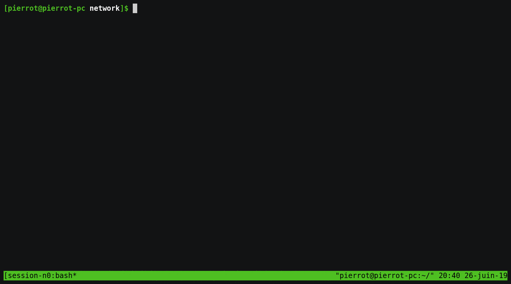

# An Haskell trip [part 4] : Networking for askBarrel a REPL client for barrelDB

- [Querying server](#Querying-server)

## Example first

Let's show what we do here.

We'll launch a server and query it in haskell.

It should look like this :



You can run it on you own

First install ghc and tmux.


```
cd network
./tmux_once.sh
```


Let's have a look at the client code